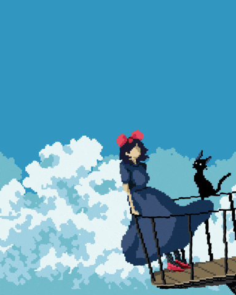

<!-- Dark Purple Hero Banner -->

  

  <table border="0" cellspacing="0" cellpadding="0">
    <tr>
      <td>
        
      </td>
      <td align="left" style="vertical-align: middle; padding-left: 24px;">
        <h1>Hey, I'm Rei! </h1>
        
          Computer Science Junior @ Cebu Institute of Technology - University 
          <b>Software Developer • Mobile/Web Developer</b> 
          <i>I need more sleep.</i>
        
      </td>
    </tr>
  </table>

---

## 🧑🏻‍💻 Stuff I've Used

  

## ✍🏻 Currently Learning

  

    

      
      
Vue.js

    

  

---

## 🏆 GitHub Achievements

  

---

## 📊 GitHub Stats

  
  
   
  

---
<!-- 
## 💼 Featured Projects

  <!-- 
   -->
<!-- 
 -->

## 📲 Connect With Me

  
  
  
  

  

