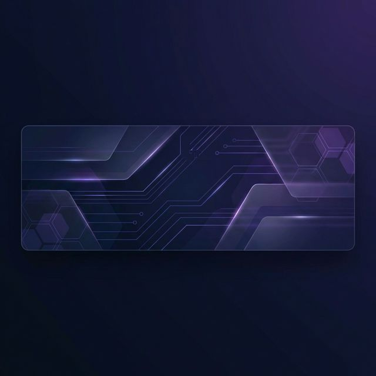

  

 

  <table border="0" cellspacing="0" cellpadding="0">
    <tr>
      <td>
        
      </td>
      <td align="left" style="vertical-align: middle; padding-left: 32px;">
        <h1 style="margin: 0; padding: 0; border: none;">Philippe Andrei Dael</h1>
        

          <strong>Software Engineer • Mobile Developer</strong>
        

        

          
          
          
        

      </td>
    </tr>
  </table>

 

---

### 🏛️ Education & Experience
- 🎓 **Computer Science Senior** | Cebu Institute of Technology - University
- 📱 **Software Developer** | Ayahay (Mobile & Web Applications)
- 🚀 **Full-Stack Enthusiast** | Building innovative digital solutions

---

### 🛠️ Technical Proficiency

#### **Languages**

  

#### **Frameworks & Tools**

  

---

### 📊 Performance Metrics

  
  

  

---

### 🏆 Recognitions

  

---

  
"Code is like humor. When you have to explain it, it's bad." — Cory House

  

